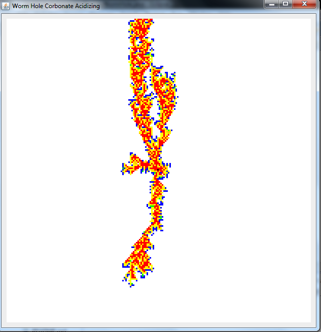

# wormhole-carbonate-acidizing
Ini merupakan sebuah program untuk memodelkan proses terbentuknya wormhole pada proses carbonate acidizing. Pemodelan ini menggunakan fuzzy logic inference.

#### Berikut ini hasil pengujiannya

